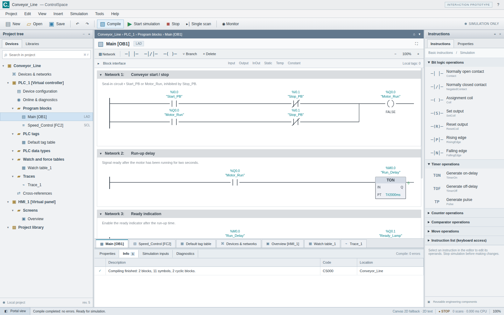

# ControlSpace

### An independent automation-engineering workspace for desktop and browser

ControlSpace explores a TIA Portal-style engineering workflow using **C# / .NET 10, Uno Platform 6.7, and shared Skia rendering**. The project separates the engineering model, compiler, virtual controller, persistence, rendering, controls, and workbench into eight reusable libraries.

**Status: 0.1.0 source preview.** This is not an exact, feature-complete, or qualified replacement for Siemens TIA Portal. The initial delivery includes Uno application source and a separately labelled, executable JavaScript interaction prototype. The Uno source has **not been compiled in the delivery environment**. GitHub Actions, binary packages, and the requested public deployment have **not been run or published** there. See [verification status](docs/verification.md) before relying on any capability claim.



*The screenshot shows the JavaScript interaction prototype, not a compiled Uno application.*

## Two deliverables, explicitly separated

| Deliverable | Location | Runtime | Initial verification |
|---|---|---|---|
| Primary application and reusable libraries | `src/` | .NET 10 / Uno / Skia | Source authored; compilation and execution pending |
| Interaction prototype | `prototype/` | ES modules; WebGPU geometry when available, Canvas 2D text/fallback | Node and Chromium interaction tests executed |

The prototype is not embedded inside the Uno app. It is a separate implementation for checking workflows and interaction design. A shared conveyor fixture checks intended runtime behavior in both engines; passing JavaScript tests does not establish C# equivalence.

The GitHub Pages workflow publishes the **real Uno WebAssembly build at the site root**. The prototype is an explicitly labelled secondary path under `/prototype/`. Staging fails if no genuine Uno bootstrap and WebAssembly binary are present; it never silently substitutes the prototype.

## Engineering workflows

The source implements a project tree, portal/project navigation, document tabs, compact engineering toolbars, an instruction palette, property editors, compile diagnostics, and virtual-controller controls. The graphical editors share the same typed project model.

| Area | Implemented scope |
|---|---|
| PLC tags | BOOL, INT, DINT, REAL and TIME; `%I`, `%Q`, `%M` addressing; overlap and value validation; comments and retain metadata |
| Ladder | Series contacts and parallel paths, NO/NC contacts, rising/falling edges, comparisons, assignment/set/reset coils, TON/TOF/TP, CTU and constant MOVE |
| SCL subset | Typed assignments, IF/THEN/ELSE/END_IF, parentheses, arithmetic, comparisons, Boolean expressions and comments; bounded parser; no `eval` |
| Virtual PLC | Explicit run/stop/reset/single-scan, input image, virtual forcing, scan-order execution, fault reporting, output clearing and bounded trace history |
| Hardware editor | Generic controller, panel and remote-I/O illustrations; editable addresses, rack modules and topology metadata; no real hardware communication |
| HMI | Editable labels, lamps, buttons, numeric displays, tanks and gauges; tag bindings; original conveyor sample; momentary virtual-input buttons |
| Persistence | Versioned ControlSpace JSON, duplicate-key rejection, import size limits, CSV tag interchange, local recovery and native atomic-save helper |
| Transactions | Model validation before commit, undo/redo, compilation invalidation, and token-aware symbol renaming |

The [capability matrix](docs/capabilities.md) distinguishes the C# source, prototype UI, and unimplemented areas. In particular, arbitrary FBD graphs, STL, GRAPH, full SCL, native Siemens project files, PLC machine-code generation, S7/PROFINET communication, WinCC compatibility, safety, drives, motion and enterprise services are not implemented.

## Reusable libraries

| Library | Responsibility | Representative public API |
|---|---|---|
| `ControlSpace.Core` | Typed model, validation, detached snapshots | `ControlProject`, `ProjectValidator`, `ProjectSnapshot` |
| `ControlSpace.Languages` | Bounded SCL parser, LAD compiler, typed intermediate representation | `SclParser`, `ProjectCompiler`, `CompiledProgram` |
| `ControlSpace.Simulation` | Deterministic virtual scans, inputs, forcing, trace | `VirtualPlc`, `ScanSnapshot`, `TraceBuffer` |
| `ControlSpace.Storage` | JSON, CSV and atomic filesystem persistence | `ProjectStorage` |
| `ControlSpace.Engineering` | UI-independent editing transactions and references | `Workspace`, `SymbolReference` |
| `ControlSpace.Rendering.Skia` | Shared vector drawing and hit regions | `EngineeringRenderer`, `RenderResult` |
| `ControlSpace.Controls.Uno` | Host-backed graphical editor, table, project tree and theme | `EngineeringCanvas`, `EngineeringTable`, `ProjectTree` |
| `ControlSpace.Workbench.Uno` | Composable engineering shell and file abstraction | `WorkbenchView`, `IProjectFiles` |

`ControlSpace.App` supplies desktop/WebAssembly entry points and platform file pickers. None of the first six libraries depends on the application shell. The two Uno libraries can be referenced by another Uno host. NuGet packaging definitions are included; no NuGet packages have been built or published in this delivery.

```csharp
using ControlSpace.Core;
using ControlSpace.Languages;
using ControlSpace.Simulation;

var compilation = ProjectCompiler.Compile(DemoProject.Create());
if (!compilation.Success)
    throw new InvalidOperationException(string.Join("\n", compilation.Diagnostics));

var plc = new VirtualPlc(compilation.Program!);
plc.SetInput("Start_PB", 1);
plc.Run();
plc.Step(TimeSpan.FromMilliseconds(100));
Console.WriteLine(plc.Read("Motor_Run")); // Intended result: 1
plc.Stop(); // Clears output-image tags and virtual forces.
```

## Build the Uno application

Prerequisites: a .NET 10 SDK and the native platform prerequisites required by Uno. `global.json` pins **Uno.Sdk 6.7.30** and allows the latest installed .NET 10 feature band. Rendering references **SkiaSharp 3.119.2** to match the selected Uno graphics integration. The selection was checked against Uno's [6.7 announcement](https://platform.uno/blog/uno-platform-6-7/) and [SKCanvasElement documentation](https://platform.uno/docs/articles/controls/SKCanvasElement.html) on 2026-09-28. It is a compatible rendering choice, not a benchmark-proven universal “best” backend.

```sh
# Portable C# tests; no Uno UI is required by this test project.
dotnet run --project tests/ControlSpace.Tests -c Release -- --fixtures tests/fixtures

# Desktop host (Windows, Linux, or macOS).
dotnet run --project src/ControlSpace.App -c Release \
  -f net10.0-desktop -p:ControlSpaceTargetFrameworks=net10.0-desktop

# WebAssembly build for the requested repository base path.
dotnet workload install wasm-tools
dotnet publish src/ControlSpace.App -c Release -f net10.0-browserwasm \
  -p:ControlSpaceTargetFrameworks=net10.0-browserwasm \
  -p:WasmShellWebAppBasePath=/ControlSpace/ -o artifacts/browser
python3 tools/prepare-pages.py artifacts/browser artifacts/site
```

These commands and CI definitions are provided for the next build-capable environment. They have not succeeded locally in the initial delivery because no .NET SDK is installed and outbound SDK downloads are unavailable.

## Run the interaction prototype

No npm dependency installation is required for the engine or prototype.

```sh
npm test
python3 tools/bundle-prototype.py
# Open artifacts/ControlSpace-prototype.html in a modern desktop browser.

# Alternatively serve the original modules:
python3 -m http.server 4173 --directory prototype
# Open http://127.0.0.1:4173/
```

Compile with **F7**, start simulation with **F5**, then toggle `Start_PB` in **Simulation inputs**. Turning `Start_PB` off leaves the motor latched; `Stop_PB` clears the circuit. The ready indicator turns on after 20 virtual 100 ms scans. Select **Overview** and **Runtime** to test momentary HMI buttons. Stop simulation before editing. **Ctrl+S** exports JSON; **Ctrl+Z / Ctrl+Y** undo/redo; **Escape** stops the simulator.

The JavaScript shell includes resizable panels, keyboard-accessible selection lists, JSON import/export, CSV import/export and model-bound property editing. Some of these interactions are more developed in the prototype than in the initial Uno shell; see the matrix rather than assuming identical behavior.

## Rendering and performance

The Uno editor derives from `SKCanvasElement` and draws into the host Skia canvas. This avoids a separate application-owned CPU bitmap upload path. Actual GPU acceleration depends on the Uno host and platform configuration; there is no separate direct WebGPU implementation inside the C# renderer.

The prototype batches geometric primitives into a WebGPU triangle pipeline when an adapter is available. Text uses Canvas 2D, and a complete Canvas 2D geometry fallback remains usable without WebGPU. Local browser testing exercised **the fallback only**, not a secure-context WebGPU device or physical GPU.

Viewport-aware LAD rendering, retained paint/font objects, bounded parser and history limits, and requestAnimationFrame coalescing are implemented. The simulator reports measured scan duration separately from virtual time. No claim of production-scale, real-time, or hardware-GPU performance is made. See [rendering and simulation semantics](docs/architecture.md).

## Automation

| Workflow | Purpose |
|---|---|
| `build.yml` | Portable C# and JavaScript tests, Windows/Linux/macOS desktop compile matrix, prototype browser interactions, portable library packages |
| `pages.yml` | Portable gate, genuine Uno WebAssembly publish, repository-base-path startup smoke test, Uno packages, Pages deployment and deployed-commit verification |
| `release.yml` | On `v*` tags: self-contained desktop archives, browser archive, all eight NuGet libraries, exact source archive, SHA-256 manifest and a GitHub prerelease |

No npm or nuget.org publishing is enabled. Release artifacts are uploaded only to GitHub. Pull-request builds cannot deploy Pages. The initial delivery could not push to GitHub; the workflows have not run. [Deployment instructions](docs/deployment.md) explain the remaining publication steps.

## Safety, compatibility and licensing

**Simulation only. Do not use ControlSpace to operate or commission real machinery.** There is no controller transport, certified safety function, hard-real-time scheduler, PLC code generator or manufacturer qualification. `Stop_PB` in the sample is a simulated process input, not an emergency stop.

ControlSpace is an original, independent implementation and is not affiliated with Siemens. Siemens and TIA Portal names are used to identify the requested workflow reference. No Siemens logos, project databases, firmware, device catalogs, screenshots or proprietary assets are distributed.

Project source: [MIT](LICENSE). Dependency notes: [THIRD-PARTY-NOTICES.md](THIRD-PARTY-NOTICES.md). Contributions: [CONTRIBUTING.md](CONTRIBUTING.md). Security boundaries: [SECURITY.md](SECURITY.md).
